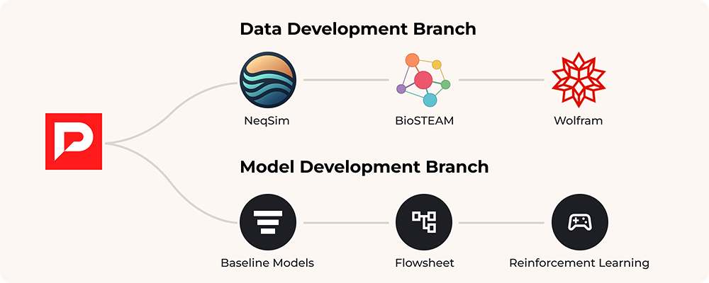
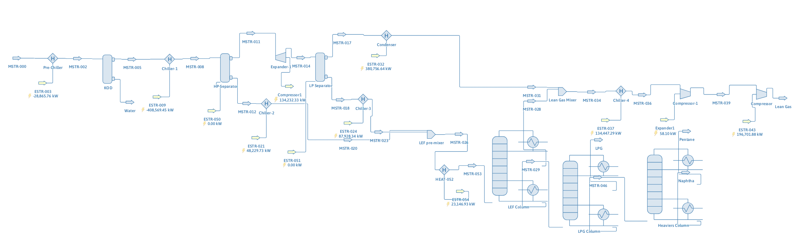
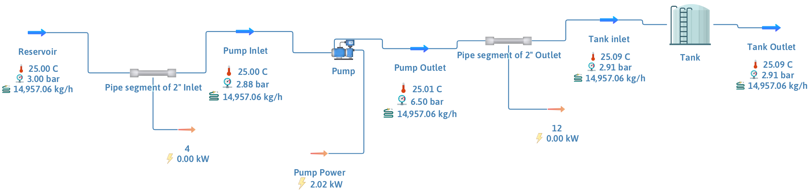
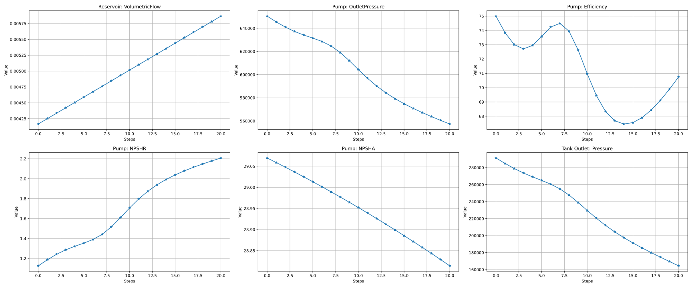

# Process Gym (Pro Gym)

<h3 align="center">
    
</h3>

<h3 align="center">
    <p>Generate infinite data for training deep learning agents for process control optimisation.</p>
</h3>

Welcome to our cutting-edge open-source project that's set to transform the landscape of Chemical, Control, and Process Engineering! 🌟. 

This project aims to provide Chemical / Control / Process Engineering researchers with a user-friendly tool to utilise Python for generating data to train deep learning (DL) models, as well as conducting step tests. Current Support 🚀 integrates Open-Source Chemical Process Simulator - [DWSim](https://dwsim.org/). We have planned integration for [NeqSim](https://equinor.github.io/neqsimhome/), [BioSTEAM](https://biosteam.readthedocs.io/en/latest/) and [Wolfram](https://www.wolfram.com/system-modeler/) over the next 4 months (more details in [Coming Soon Section](https://github.com/kashmirintelligence/dwsim_gym/tree/3-initial-refactor-the-code-for-open-source?tab=readme-ov-file#-coming-soon)).

**We will also be adding predictive models and reinfrocement learning agent for users to experiment with directly.**

## 🤝 Join Our Community

We believe in the power of collaboration. If you have ideas for specific datasets, simulators, or models you'd like to see supported, we want to hear from you! Our dedicated engineering team is committed to making AI accessible in even the most complex industries, pushing the boundaries of R&D in process optimisation 😁🤘.

Have questions? Need support for a flowsheet we don't yet offer? or new simulators? datasets? models? We're here to help!
- 🐞 Raise an issue on our GitHub repository
- 💬 Join our [Slack Community](https://join.slack.com/t/ki-opensource/shared_invite/zt-2rl9f552a-rgdTYrbVxX7clQed9FEXnw)! [](https://join.slack.com/t/ki-opensource/shared_invite/zt-2rl9f552a-rgdTYrbVxX7clQed9FEXnw) 

## 📋 Description
Our latest features are designed to streamline your workflow and amplify your research capabilities:

1. 🔗 Dynamic Flowsheet Integration: Seamlessly load complex [flowsheets](https://dwsim.fossee.in/flowsheeting-project/completed-flowsheet) to create rich, realistic experimental environments.

2. 🔍 Comprehensive Variable Retrieval: Gain instant access to all variables from operational units within your process.

3. 🎛️ Precision Parameter Control: Take command of your simulations with flexible control over operational unit parameters.

These powerful features combine to create a robust platform that adapts to your research needs, whether you're optimising existing processes or pioneering new frontiers in process engineering. These 3 features will be replicated for every simulator we integrate.

## 🔮 Coming Soon
<div align="center">
  
</div>

### 🧪 Data Development Branch: Simulator Integration
Over the next **four** months, we aim to integrate the following simulators into our *Pro Gym* platform:
- [NeqSim](https://equinor.github.io/neqsimhome/): A library for calculation of fluid behaviour, phase equilibrium and process simulation.
- [BioSTEAM](https://biosteam.readthedocs.io/en/latest/): An open-source platform that streamlines the design, simulation, techno-economic analysis (TEA) and life-cycle assessment (LCA) of biorefineries across thousands of scenarios.
- [Wolfram](https://www.wolfram.com/system-modeler/): A next-generation modeling and simulation environment for cyber-physical systems.

### 🤖 Model Development Branch: Deep Learning Enhancements
Over the next **six** months, we plan to expand our platform's machine learning and deep learning capabilities by implementing the following features:
- Introduce pre-built baseline models for prediction tasks.
- Incorporate deep learning models for flowsheet optimisation tasks, enabling discovery of optimal configurations automatically.
- Provide OpenAI-Gym-like environments for training and evaluating Reinforcement Learning (RL) agents to optimise process engineering tasks end-to-end.

## Getting Started
This process involves two steps:

1. Clone this repository using the following command (this will automatically clone submodules too):

```shell
git clone git@github.com:kashmirintelligence/pro_gym.git
```

2. Set up the environment using either Anaconda or Docker.

### Anaconda 🐍
**Note**: *The following instructions are for Ubuntu 22.04.*
1. Install dependencies:
```bash
sudo apt-get install mono-complete mono-vbnc gtk-sharp2 libfontconfig1-dev coinor-libipopt1v5
# download DWSim
wget -O /tmp/dwsim_8.8.0-amd64.deb https://github.com/DanWBR/dwsim/releases/download/v8.8.0/dwsim_8.8.0-amd64.deb
# install
dpkg -i /tmp/dwsim_8.8.0-amd64.deb || true
```
2. Create and activate a virtual environment:
```bash
# create the virtual environment
conda create --no-default-packages -n pro_gym python=3.10
# activate the virtual environment
conda activate pro_gym
```
3. Install required Python packages:
```bash
# install required packages
pip install -r requirements.txt
# install dwsim_gym package
pip install -e .
```

### Docker 🐳
1. Build the Docker image using the provided `Dockerfile`:
```bash
docker build -t pro_gym .
```
2. Run the Docker container:
```bash
docker run -it --name pro_gym_exp pro_gym /bin/bash
```
Once inside the container (in the `/pro_gym` directory), you can easily run the examples:
```bash
cd examples/
python data_generator.py
```

## Example Usage
### Supported Environments
- `NaturalGasProcessing-v0`: [Natural Gas Processing Simulation.](https://dwsim.fossee.in/flowsheeting-project/dwsim-flowsheet-run/122)
- `PSD-v0`: [Separation of Di-isopropyl Ether and IsoPropyl Alcohol using Pressure Swing Distillation Process with Vapor Recompression.](https://dwsim.fossee.in/flowsheeting-project/dwsim-flowsheet-run/374)
- `AutomationPump-v0`: [A Pump Automation Simulation that Demonstrates the Fundamentals of Automating Pump Operations.](https://github.com/virajdesai0309/DWSim-Automation-Repo/tree/main/01%20Automation%20of%20Pump)

### Dataset Generator

To create Pro Gym instances for the *[Natural Gas Processing Simulation](https://dwsim.fossee.in/flowsheeting-project/dwsim-flowsheet-run/122)*, follow this example:
```python
import pro_gym
# path of flowsheet - in this case we select flowsheet 51
env = pro_gym.make("NaturalGasProcessing-v0")
# print the related simulation objects
env.print_sim_objects()
```
Once the environment is created, we can use it to generate samples:
```python
# get the observation
obs = env.get_obs()
# get the intial value of variable to be changed
init_mass_flow = obs["MSTR-000"]["Mass Flow"]
# record the 
for itr in range(10):
    # make changes to the variables
    init_mass_flow += 10
    # set the specific variable to the specific operation unit
    actions = {"MSTR-000": {"MassFlow": init_mass_flow}} 
    # execute the actions and get new observations
    obs_next, _, _, _ = env.step(actions)
    # reset the env to the initial value
    env.reset()
    # log
    print("Iteration: {}, Actions: {}".format(itr+1, actions))
    # observe the resulting outputs
    print(obs["Lean Gas"])
```

To generate a dataset for training ML models, run the following script `examples/data_generator.py`:
```bash
# generate the dataset for natural gas processing
cd examples/
python data_generator.py --env NaturalGasProcessing-v0 --action-config config/natural_gas_proc.yaml --steps 10000
```
The resulting data will be saved in the `saved_csv/` folder.

### Step Tests

An example of using **Pro Gym** to perform step tests can be found in the `examples/step_test.py` script, which is based on the *[Automation of Pump](https://github.com/virajdesai0309/DWSim-Automation-Repo/tree/main/01%20Automation%20of%20Pump)* case study. To run the step test, execute the following commands:
```bash
cd examples/
python step_test.py
```
In this case study, we conduct a linear step-wise increase in the **volumetric flow** of the **Reservoir** and observe the corresponding variations in other units. Upon running the script, the results will look like this:


## Troubleshooting
If you encounter the following error, please run `bash start_screen.sh`:
```
APP CRASH!!!

System.TypeInitializationException: The type initializer for 'System.Windows.Forms.XplatUI' threw an exception. ---> System.ArgumentNullException: Could not open display (X-Server required. Check your DISPLAY environment variable)
Parameter name: Display
  at System.Windows.Forms.XplatUIX11.SetDisplay (System.IntPtr display_handle) [0x00435] in <a3daa9b84fd241a497578a25f68bc3c7>:0 
  at System.Windows.Forms.XplatUIX11..ctor () [0x00077] in <a3daa9b84fd241a497578a25f68bc3c7>:0 
  at System.Windows.Forms.XplatUIX11.GetInstance () [0x0001c] in <a3daa9b84fd241a497578a25f68bc3c7>:0 
  at System.Windows.Forms.XplatUI..cctor () [0x000e3] in <a3daa9b84fd241a497578a25f68bc3c7>:0 
   --- End of inner exception stack trace ---
  at System.Windows.Forms.Application.EnableVisualStyles () [0x00006] in <a3daa9b84fd241a497578a25f68bc3c7>:0 
  at Eto.WinForms.Forms.ApplicationHandler..ctor () [0x00011] in <b332123567ca45aa859bb9eb17693ca7>:0 
  at Eto.WinForms.Platform+<>c.<AddTo>b__10_85 () [0x00000] in <b332123567ca45aa859bb9eb17693ca7>:0 
  at Eto.Widget..ctor () [0x0006a] in <23bf6400f02d49eba883a8238fbdb959>:0 
  at Eto.Forms.Application..ctor (Eto.Forms.Application+InitHelper init) [0x00016] in <23bf6400f02d49eba883a8238fbdb959>:0 
  at Eto.Forms.Application..ctor (Eto.Platform platform) [0x00007] in <23bf6400f02d49eba883a8238fbdb959>:0 
  at DWSIM.UI.Desktop.Program.MainApp (System.String[] args) [0x00543] in <49843ddbbc0c45d185e4e14f5efe8ef8>:0 
```

## Become a Contributor
We welcome all contributions and feedback on **Pro Gym**. Please refer to the [contributor's guide](CONTRIBUTING.md) for how to prepare your contributions. For feedback and feature requests, please get in touch on our [Slack Channel](https://join.slack.com/t/ki-opensource/shared_invite/zt-2rl9f552a-rgdTYrbVxX7clQed9FEXnw). Let's revolutionise process engineering together! 🚀🔧🧪

## Acknowledgement
We would like to express our sincere appreciation to the creators & developers of [DWSIM](https://github.com/DanWBR/dwsim) for open sourcing the simulator. A special thank you to our core development team, whose tireless efforts have brought Pro Gym to life: [@Tianhong](https://github.com/TianhongDai), [@James](https://github.com/jamestfriesen), [@Tong](https://github.com/iammtong) and [@SamTukra](https://github.com/SamPlvs).

And to you! For being part of the journey, future contributions and feedback for improving Pro Gym, we are deeply grateful. Your contributions, big and small, will and have made a significant impact.

<picture>
  <source media="(prefers-color-scheme: dark)" srcset="assets/logo_dark.svg">
  <source media="(prefers-color-scheme: light)" srcset="assets/logo.svg">
  
</picture>